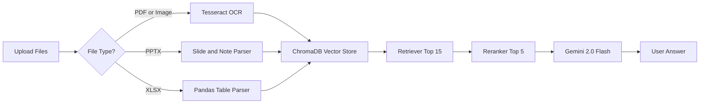

# MQNotebook: Enterprise-Grade RAG System

**MQNotebook** is a production-ready, local Retrieval-Augmented Generation (RAG) engine designed to handle the "messy" reality of enterprise documents. 

Unlike standard "Chat with PDF" demos, this system is engineered to ingest scanned files, complex spreadsheets, and slide decks with speaker notes—running securely on your local machine or the cloud.

🔗 **Live Demo:** [mqnotebook.streamlit.app](https://mqnotebook.streamlit.app/)

---

## 🚀 Key Capabilities

### 1. "Hardcore" Document Pipeline
Standard Python parsers often fail on complex office documents. MQNotebook uses a custom brute-force extraction pipeline:
* **Scanned PDFs & Images:** Integrated **Tesseract OCR + Poppler**. If standard text extraction fails, it renders the page as a high-res image and reads the pixels.
* **PowerPoint (.pptx):** Extracts text not just from slides, but also from **SmartArt, Shapes, and Speaker Notes** (crucial context often missed by other tools).
* **Excel (.xlsx):** Parses spreadsheets row-by-row, preserving structure so the AI understands column relationships.

### 2. Hybrid AI Architecture
* **LLM:** **Gemini 2.0 Flash** (via OpenRouter) for massive context windows and fast reasoning.
* **Embeddings:** **BAAI/bge-small-en-v1.5** (Runs locally on CPU).
* **Precision:** Includes a **Cross-Encoder Reranker**. The system retrieves the top 15 matches but filters them down to the top 5 *conceptually relevant* chunks before the LLM ever sees them.

### 3. Engineering Robustness
* **Windows File Locking Fix:** Implements a dynamic, timestamped session architecture to prevent `WinError 32` (file in use) errors when resetting ChromaDB on Windows.
* **Smart OS Detection:** Automatically detects if it's running on Windows (Local) or Linux (Cloud) and switches between local `.exe` paths and system binaries for OCR tools.

---

## 🛠️ Installation (Local)

To run this locally, you must install the external OCR tools.

### 1. Prerequisites (Windows)
* **Tesseract OCR:** Download the installer from [UB-Mannheim](https://github.com/UB-Mannheim/tesseract/wiki).
    * *Default Path:* `C:\Program Files\Tesseract-OCR`
* **Poppler:** Download the binary from [Poppler Releases](https://github.com/oschwartz10612/poppler-windows/releases).
    * Extract the folder. You will need the path to the `bin` folder inside.

### 2. Python Setup
```bash
# Clone the repo
git clone [https://github.com/yourusername/MQNotebook.git](https://github.com/yourusername/MQNotebook.git)
cd MQNotebook

# Install dependencies
pip install -r requirements.txt
```

### 3. Configuration
##### 1. Create a `.env` file in the root directory:
```
OPENROUTER_API_KEY=sk-or-your-key here
# Get one for free from Open Router
```

##### 4. **Crucial**: Open `config.py` and verify your local paths match where you installed the tools:
```
# config.py
if platform.system() == "Windows":
    pytesseract.pytesseract.tesseract_cmd = r'C:\Program Files\Tesseract-OCR\tesseract.exe'
    POPPLER_PATH = r"C:\path\to\poppler\Library\bin"
```

##### 5. Run the App
```
streamlit run app.py
```

---

# How to Use
### Free Mode (Default)
- Select "Free" in the sidebar.
- Uses the hosted API key provided by the developer.
- Limit: Capped at 10 questions per session to prevent abuse.

### Pro Mode (BYOK)
- Select "Pro" in the sidebar.
- Enter your own OpenRouter API Key.
- Limit: Unlimited. Your key is stored only in your session RAM and is cleared immediately upon refresh or logout.

--- 

# Architecture Overview




### Notes

- Works in **VS Code**, **GitHub**, **GitLab**, and **Obsidian** (with Mermaid enabled)
- Uses `graph LR` for left-to-right flow
- Explicit arrows from `C/D/E → F` (more compatible than `C & D & E --> F`)

